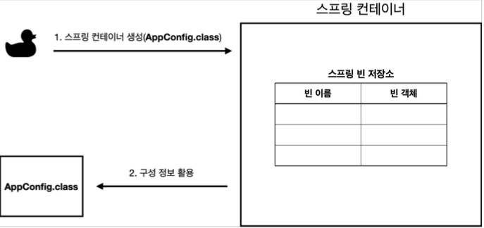
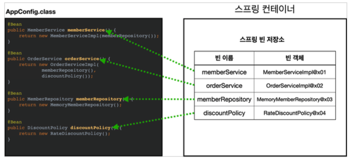
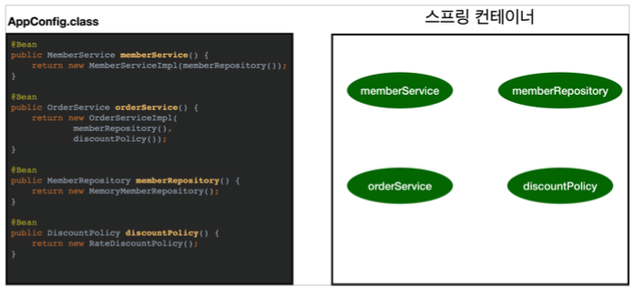
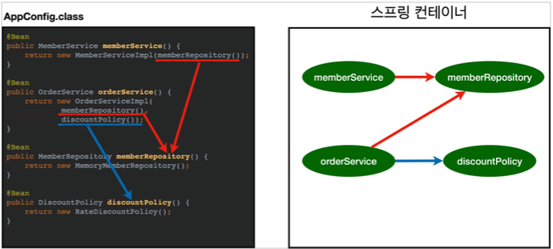
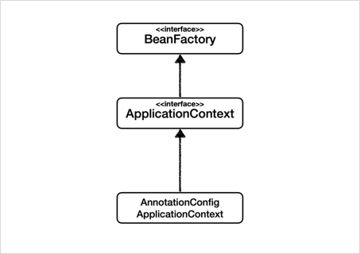

## 스프링 컨테이너 생성
```java
//스프링 컨테이너 생성
ApplicationContext applicationContext = new AnnotationConfigApplicationContext(AppConfig.class); 
```
- AppicationContext 를 스프링 컨테이너라 한다.
- 스프링 컨테이너는 xml 기반으로 만들수도 있고, 어노테이션 기반의 자바 설정 클래스로 만들수 있다.
- 더 정확히는 스프링 컨테이너를 부를 때 BeanFactory , ApplicationContext 로 구분해서 이야기 한다. 이 부분은 뒤에서 설명하겠다. BeanFactory 를 직접 사용하는 경우는 거의 없으므로 일반적으로 ApplicationContext 를 스프링 컨테이너라 한다. 

### 스프링 컨테이너의 생성 과정
#### 1. 스프링 컨테이너 생성


- New AnnotaionConfigApplicationContext(AppConfig.class) : 스프링 컨테이너를 생성할 때는 구성 정보(AppConfig.class)를 지정해주어야 한다.

#### 2. 스프링 빈 등록


- 설정 클래스 정보를 사용해서 스프링 빈을 등록(AppConfig)
- 빈 이름은 직접 부여할수있지만(@Bean(name=“”), default 값인 메소드 이름을 사용(빈이름은 항상 달라야함)

#### 3. 스프링 빈 의존관계 설정 - 준비

 
#### 4. 스프링 빈 의존관계 설정 - 완료


- 스프링 컨테이너는 설정 정보를 참고해서 의존관걔를 주입한다.(단순 자바코드를 호출하는것 같지만, 차이가 잇다.)
- 참고 : 스프링은 빈을 생성, 의존관계를 주입하는 단계가 나누어져 있다. 자바 코드로 스프링 빈을 등록하면 생성자를 호출하면서 의존관계 주입도 한번에 처리된다. 자세한 내용은 의존관계 자동 주입에서 다시 설명


## 컨테이너에 등록된 모든 빈 조회
- ac.getBeanDefinitionNames() : 스프링에 등록된 모든 빈 이름 조회
- ac.getBean(beanDefinitionName) : 빈 이름으로 빈 객체를 조회.
- beanDefinition.getRole() : 스프링 내부에서 사용하는 빈, 사용자 정의 빈(애플리케이션 빈)을 구분할 수있다
- ROLE_APPLICATION : 사용자 정의 빈 / ROLE_INFRASTRUCTURE : 스프링 내부에서 사용하는 빈

## 스프링 빈 조회 - 기본
- ac.getBean(빈이름, 타입),ac.getBean(타입) : 스프링 컨테이너에서 스프링 빈을 찾는 가장 기본적인 조회 방법
- 조회 대상이 없을 경우 에러 : NoSuchBeanDefinitionException: No bean named "xxxx" available
- //구체 타입으로 조회 가능하지만 유연성이 떨어짐(구현에 의존 X)
   MemberService memberService = ac.getBean("memberService", MemberService.class);

## 스프링 빈 조회 - 동일한 타입이 둘 이상
- 타입으로 조회시 같은 타입의 스프링 빈이 둘 이상이면 오류가 발생한다. 이때는 빈 이름을 지정하자.
- ac.getBeansOfType() 을 사용하면 해당 타입의 모든 빈을 조회할 수 있다.

## 스프링 빈 조회 - 상속 관계
- 부모 타입으로 조회하면, 자식 타입도 함께 조회한다.
- 모든 자바 객체의 최고 부모인 Object 타입으로 조회하면, 모든 스프링 빈을 조회된다.

## BeanFactory와 ApplicationContext(스프링 컨테이너라 한다.)


### BeanFactory
- 스프링 컨테이너의 최상위 인터페이스로 스프링 빈을 관리하고 조회하는 역할(getBean() 제공)
### ApplicationContext


- BeanFactory 기능을 모두 상속받아서 제공(BeanFactory를 직접 사용할 일은 거의 없다.)
- 애플리케이션 개발 시, 빈 관리나 조회 이외에 수많은 부가 기능이 필요함
- MessageSource 메시지를 활용한 국제화 기능
- 환경변수
  - 로컬, 개발, 운영등을 구분해서 처리
- 애플리케이션 이벤트
  - 이벤트를 발행하고 구독하는 모델을 편리하게 지원
- 편리한 리소스 조회
  - 파일, 클래스 패스, 외부 등에서 리소스를 편리하게 조회


## 스프링 빈 설정 메타 정보 - BeanDefinition
### 정리
- 1. 스프링은 스프링 빈설정 메타정보를 BeanDefinition으로 추상화한다.
- 2. 스프링 빈을 등록하는 크게 두가지 방법이 있음. 직접 스프링 빈을  스프링 컨테이너에 등록하는 방법, 우회방법으로 펙토리 빈(펙토리 메소드를 통해서)으로 빈을 등록하는 방법(자바 config)
