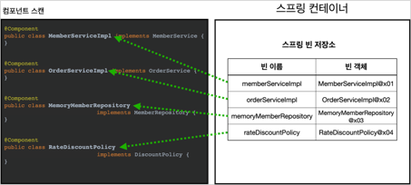
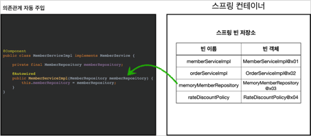

# 컴포넌트 스캔
## 컴포넌트 스캔과 의존관계 자동 주입
- 스프링 빈을 등록할 때 자바 @Bean, XML의 <bean> 등으로 설정 정보에 직접 등록할 스프링 빈을 나열했다.
스프링 빈의 개수가 많아지면 일일이 등록하기 귀찮고, 설정 정보도 커지고, 누락하는 문제도 있다.
- 스프링은 설정 정보가 없어도 자동으로 스프링 빈을 등록하는 컴포넌트 스캔이라는 기능을 제공한다.
- @ComponentScan : @Component 붙은 클래스를 스캔해서 스프링 빈으로 등록한다.
- 의존관계 자동으로 주입하는 @Autowired라는 기능도 제공한다.

<br>

**AutoAppConfig.java**
``` java
@Configuration
@ComponentScan(
    excludeFilters = @Filter(type = FilterType.ANNOTATION, classes = Configuration.class)
)
public class AutoAppConfig {
}
```
- 설정 정보에 @ComponentScan을 붙여주면 된다.
- 컴포넌트 스캔은 @Configuration이 붙은 설정 정보도 자동으로 등록된다. (@Configuration에 @Component가 붙어있기 때문)
- 보통 설정 정보를 컴포넌트 스캔 대상에서 제외하지 않는다.

<br>

**MemberServiceImpl.java**
``` java
@Component
  public class MemberServiceImpl implements MemberService {

      private final MemberRepository memberRepository;

      @Autowired
      public MemberServiceImpl(MemberRepository memberRepository) {
          this.memberRepository = memberRepository; 
    }
}
```
- 기존에 @Bean으로 직접 설정 정보 작성, 의존관계 명시 했었지만, @Component와 @Autowired만 붙여주면 된다.

<br>

### 컴포넌트 스캔, 의존관계 주입의 동작
**1. @ComponentScan**



- @Component가 붙은 모든 클래스를 스프링 빈으로 등록한다.
- 빈이름은 자동 지정, 직접 지정이 있다.
  - **자동 지정**: 빈의 이름은 클래스 명으로 맨 앞글자만 소문자를 사용한다. MemberServiceImpl -> memberServiceImpl
  - **직접 지정**: @Component("memberService2")로 지정 할 수 있다.

<br>

**2. @Autowired 의존관계 자동 주입**



- 생성자에 @Autowired를 지정하면, 스프링 컨테이너가 자동으로 해당 스프링 빈을 찾아서 주입한다.
- 기본 조회 전략은 같은 타입의 빈을 찾아서 주입한다. (getBean(MemberRepository.class)와 동일)

<br>

## 탐색 위치와 기본 스캔 대상
### 탐색할 패키지의 시작 위치 지정
필요한 위치부터 탐색하도록 시작위치를 지정 할 수 있다.(모든 클래스를 컴포넌트 스캔하면 오래 걸림)  
지정하지 않으면 @ComponentScan이 붙은 설정 정보 클래스의 패키지가 시작 위치가 된다.

<br>

``` java
@ComponentScan(
    basePackages = "hello.core",
)
```
- basePackages : 탐색할 패키지의 시작 위치를 지정한다.
  - basePackages = {"hello.core", "hello.service"} 여러개도 가능
- basePackageClasses : 지정한 클래스의 패키지를 탐색 시작 위치로 지정한다.

**권장하는 방법**

패키지 위치를 지정하지 않고, 설정 정보 클래스를 프로젝트 최상단에 두는 것이다.(스프링 부트도 기본으로 이 방법을 쓴다.)  
스프링 부트의 대표 시작 정보인 @SpringBootApplication을 프로젝트 시작 루트 위치에 두는 것이 관례이다.(설정안에 @ComponentScan이 들어 있다.)

<br>

### 컴포넌트 스캔 기본 대상
컴포넌트 스캔은 @Component 외의 추가로 대상에 포함한다.
- @Component : 컴포넌트 스캔에서 사용
- @Controller : 스프링 MVC 컨트롤러에서 사용
- @Service : 스프링 비즈니스 로직에서 사용(특별한건 없고, 비즈니스 로직이 있겠구나 인식 정도의 역할)
- @Repository : 스프링 데이터 접근 계층에서 사용
- @Configuration : 스프링 설정 정보에서 사용

아래와 같이 @Component를 포함하고 있다.
``` java
@Component
public @interface Controller {
}
```


- 중요 : 애노테이션 자바 X 스프링 O
- 에노테이션은 메타정보 -> 아 이걸보고 이걸 더해야지 할수 있다.
- @Repository: 이게 없다면 서비스까지 예외가 올라오는데 그렇게 되면 a-> b db로 바뀌엇을때 서비스를 다 고쳐야함 --> 스프링이 예외를 추상화해서 변환해줌

## 필터
- 인터페이스 만들때 Target이 중요함

## 중복 등록과 충돌
- 개발은 혼자하는게 아님 애매한 상황을 만들지 않는게 제일 좋음. 어설픈 추상화, 코드는 깔끔하지 않지만, 명확한게 더 나음(깔끔하지만 명확하지 않은것 보다)